# Set up your Github and VSCode

In preparation for interactivity II!

---

# Prerequisite

1. Download [git](https://git-scm.com/install) to your computer(if you are in the classroom, it should already be downloaded)
<br> 
<div v-click>
a. Windows: install the corresponding installer from [git's website](https://git-scm.com/install/windows) </div>
<div v-click><br>b. Mac: 
<br>
--   i. click `Command + Space bar` <br>
--   ii. type in `terminal`<br>
-- iii.copy the following code in, hit enter:
</div>
<div v-click>

```shell
/bin/bash -c "$(curl -fsSL https://raw.githubusercontent.com/Homebrew/install/HEAD/install.sh)"
```
</div>
after it finished download, copy the following code and hit enter

```shell
brew install git
```  
<br>

2. Download [VScode](https://code.visualstudio.com/) to your computer
3. Register a [GitHub](https://github.com/) account (you can do this while downloading the previous two)

<!--
[click:3] this is to install a package manager called home-brew, which is good for your long run anyway if you want to keep coding or doing web development
-->

---

# Configure github

1.  After installing, check whether git is properly instlled. copy these into your terminal or cmd and run.
```shell
git --version
```
2. in your terminal/cmd, copy the following code, change `yourName` into your name, don't have to be the github user name. 
```shell
git config --global user.name "yourUserName"
```
3. copy the following code to your terminal, hit enter. change `yourEmail` to the email that IS linked to the github account.
```shell
git config --global user.email "yourEmail"
```
---
layout: two-cols
---

# Template

1. Go to This template for [helloWorld](https://github.com/lilyxia99/LeileiXia_interactivityIISP2026_helloWorld) Project
2. click "Use this template" on the upper right corner-> Create a new respository
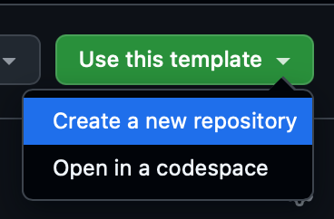
::right::
3. name your repository as **"yourName_interactivityIISP2026_helloWorld" and set visibility to "Public"**, hit "create repository"
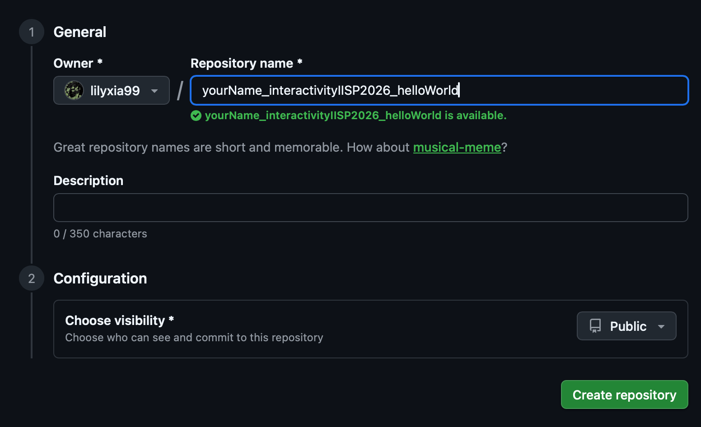

---


4. After hitting Create repository, it should guid you to the home page of your repository. Go to "Settings" on the top menu
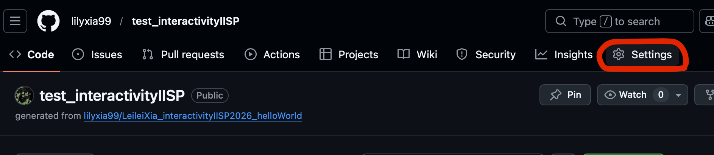

<br>

5. On the left, select "Pages", under Github Pages, under "Branch", select "Main" to deploy your main branch as the source of the GitHub pages. This will turn the main content of what's inside your current repository into a website. 

---

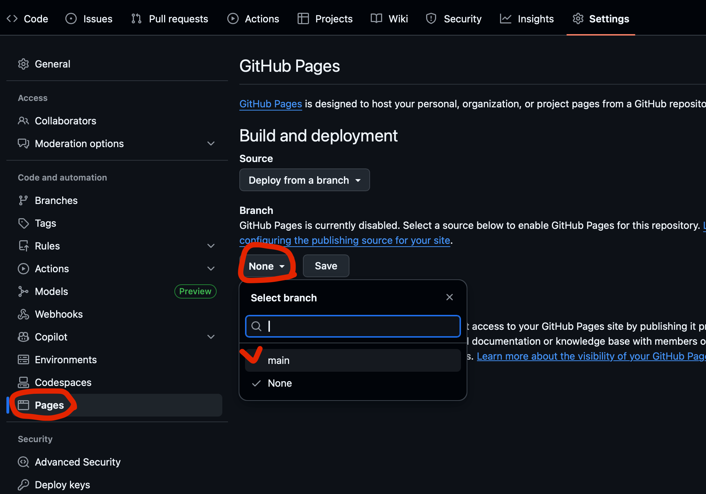{size=80%}


---

6. It will take a while to generate the GitHub pages. While we are waiting for it, in your computer (or if you are in the school lab, go to StorageSSD, create a folder of your name), create a folder called "interactivityIISP26", under it, create a folder called "helloWorld",

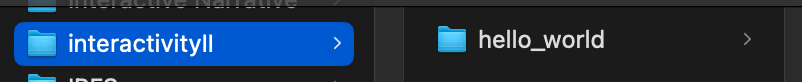

7. If you are using Mac, you will right click the hello_world folder, and hold alt key to select "Copy'hello_world' as Pathname". If you are using windows, you can just open hello_world folder, and right click the empty space in the folder, select "Run Powershell from here"

---

{size=80%}


---

8. hit search button on your top right (Mac) or just search from your start menu (windows), type in "terminal" or "cmd"

>A computer terminal is a text-based interface (app or hardware) for giving commands to a computer. It's an old and more fundemental way of how computer operates. All the software and graphis UI that we are using is basically making the text order looks more visualize, but the essense is still sending orders like this through text. 

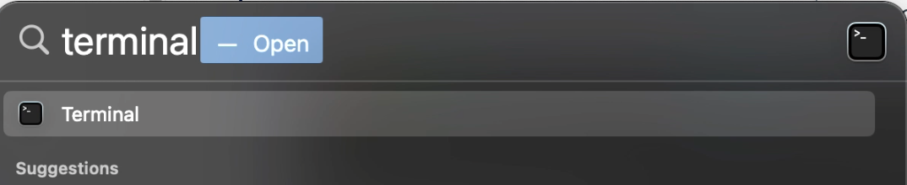

---

9. In your terminal/cmd/powershell, type in "cd", space, and then paste the path name that you have just copied. 

>cd basically means locating the terminal to a certain folder to run something. We will explain this more later, but right now just understand it as if you are moving this operator into a building, and say "you start work here"

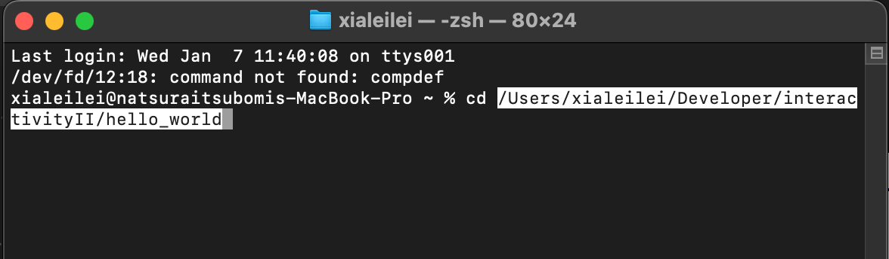{.w-150}

and then it will look like something like this, which means this terminal is set to that specific folder now. 

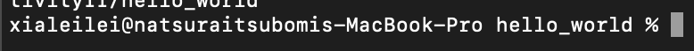

---

10. go back to your repository, from the top menu, go to "Code", and find the green "Code" button, under "HTTPS", hit the button of copy to copy the link to the clipboard

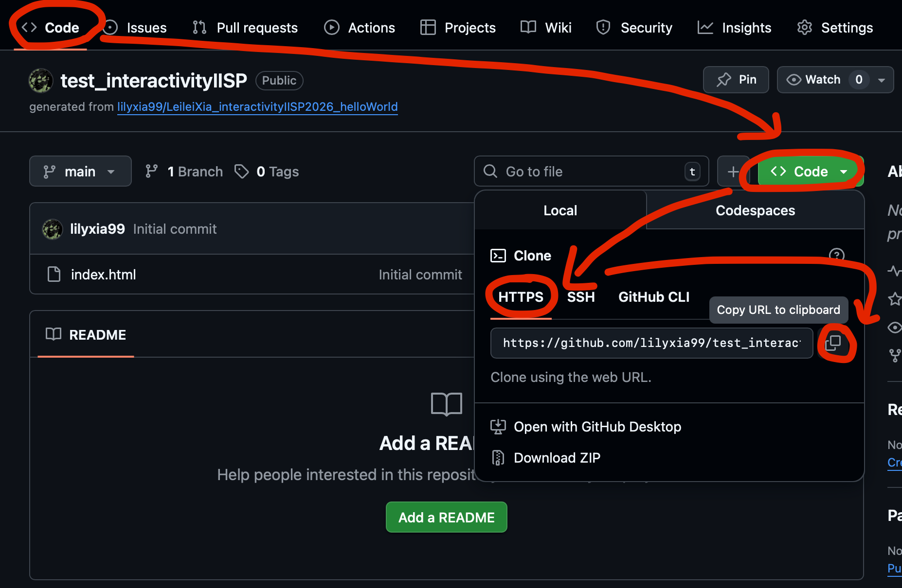

---

11. Go back to your terminal, type in "git clone " (there is a space after clone and in between git and clone) and then paste in the link you had. Make sure to install git beforehand.

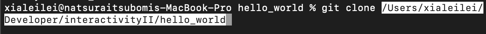

You can copy the code below. (hover your mouse on the right side of the block below to "copy")<br>
```shell 
git clone yourLink <- replace it as your own link
```

---


12. after that you should be able to see a folder being copied inside your hello_world folder. select that folder

<arrow  x1="350" y1="310" x2="400" y2="270" color="rgba(238, 98, 29, 1)" width="2" arrowSize="2" />

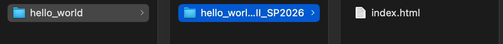

13. Open your VScode

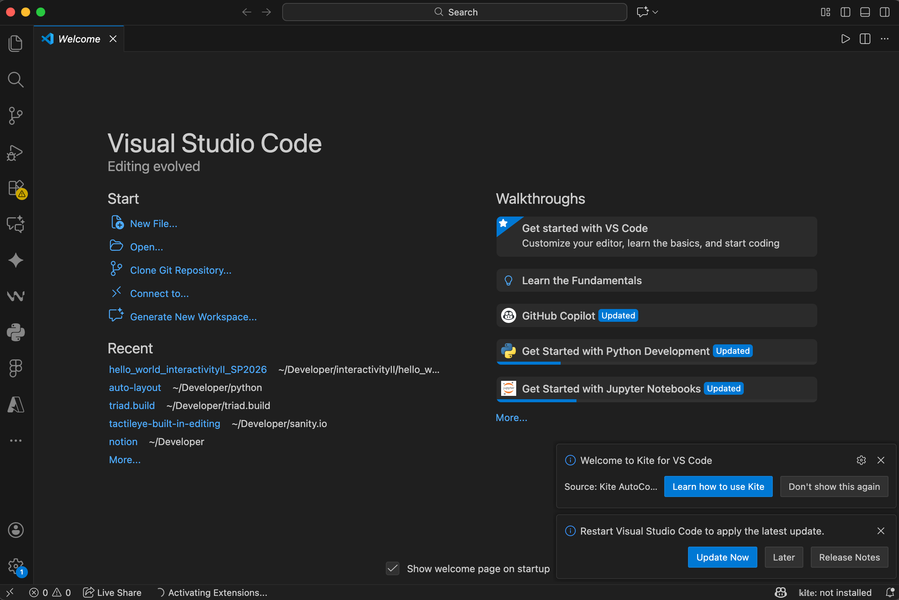{.w-150}

---
layout: two-cols
---

14. either go to "Open" and select that whole folder, or drag that folder into the VSCode window here in any empty space. 

15. Go to "Extensions" Tab on the left side, search "Live Share", install and enable it

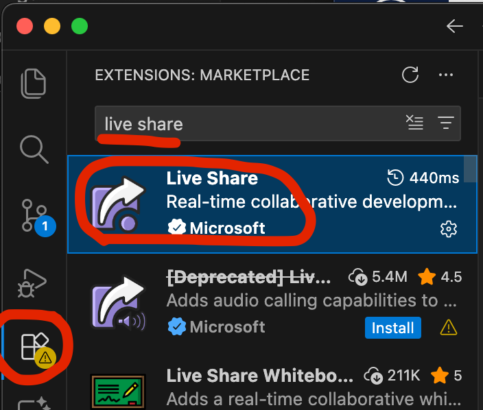{.w-90}
::right::
16. do the same, install Live Server as your extension

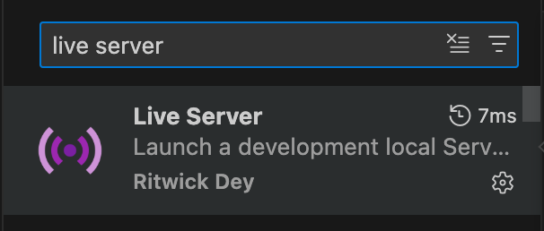

17. On the lower left side of your VSCode window, click LiveShare to Start Collaboration Session
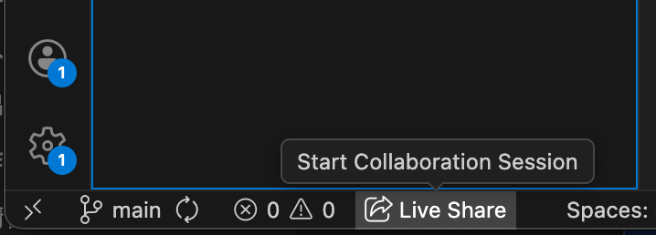
---

18. The links to your live share should be automatically copied. Go to this  [shared document](https://uncg-my.sharepoint.com/:w:/r/personal/l_xia_uncg_edu/_layouts/15/doc.aspx?sourcedoc=%7B00e0fafe-aa00-4ee6-bc1e-c7eaf9863ac5%7D&action=edit), paste the link into your name's row under the Live Share column.

 
19. Under the bottom of your VSCode, click "Go Live"
{.w-100}
---

20. It will pop up a new window, and if you change things in your html, and command/control+S to save it, it will be updated to your browser live

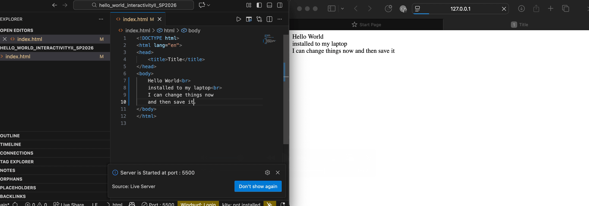

---

21. change something, save it (command/control+S)

````md magic-move {lines: true}
```html 
  <!DOCTYPE html>
  <html lang="en">
  <head>
      <title>Title</title>
  </head>
  <body>
      Hello World
  </body>
  </html>
```
```html {all|8}
  <!DOCTYPE html>
  <html lang="en">
  <head>
      <title>Title</title>
  </head>
  <body>
      Hello World
      write something
  </body>
  </html>
```
````
---

22. Go to the "Source Control" Panel on the left side, this is where you can update your changes to your own repository. type in a message that summarize what you just did. hit the little blue triangle on the right side, hit "Commit &. Synch"

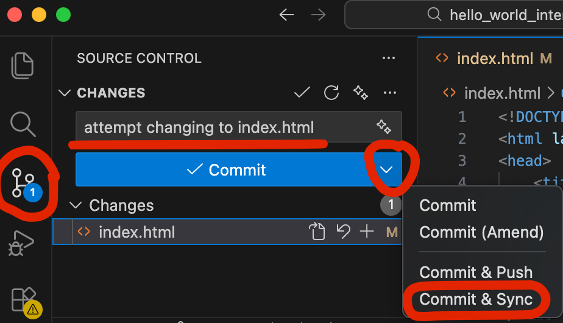{.w-150}

<!--commit means you a saving these changes as a version, and sync means you are pushing your saves versions to the cloud-->

---

23. You might be prompted to log in(from your button right corner), 
`"The extension 'GitHub' wants to sign in using GitHub."`You need to click Allow.

hit allow. If you can't push, it's possible that your email is configured wrong. <br>
After syncing, when you go back to your repository, You can see the message that you have just typed in showing up beside the document you just edited. Click the index.html file

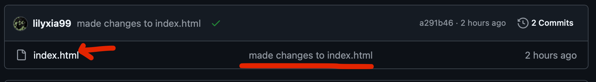

24. You will see the changes you have made are saved to the code itself. 


---

25. Go to "Settings"->"Pages", now your GitHub pages should be ready, although likely not reflecting the changes you have made. But it's ok.

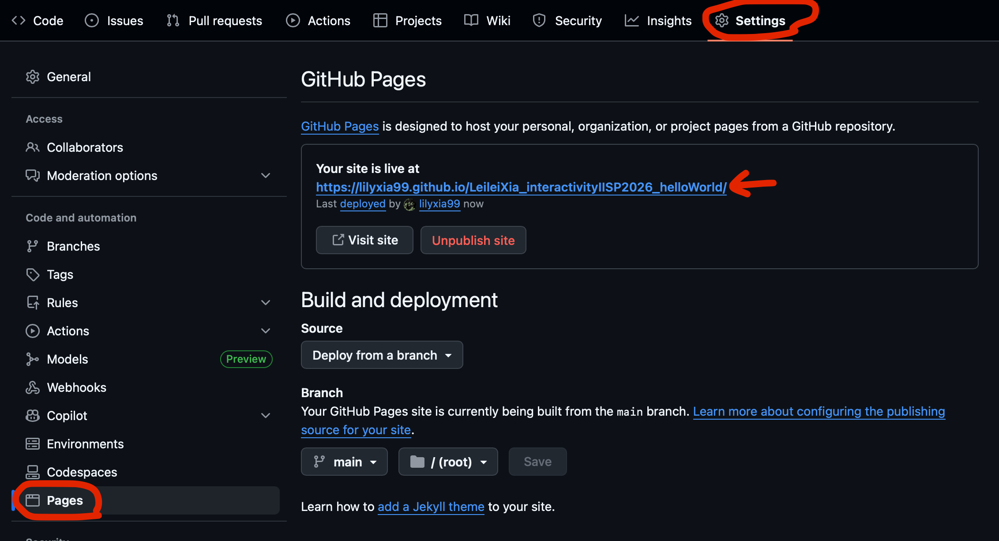{.w-180}

---

26. Copy that link, go back to your code tab, on the right side on the About, click the little gear button, you can quickly edit the repository details. Paste the link into the Website Section.

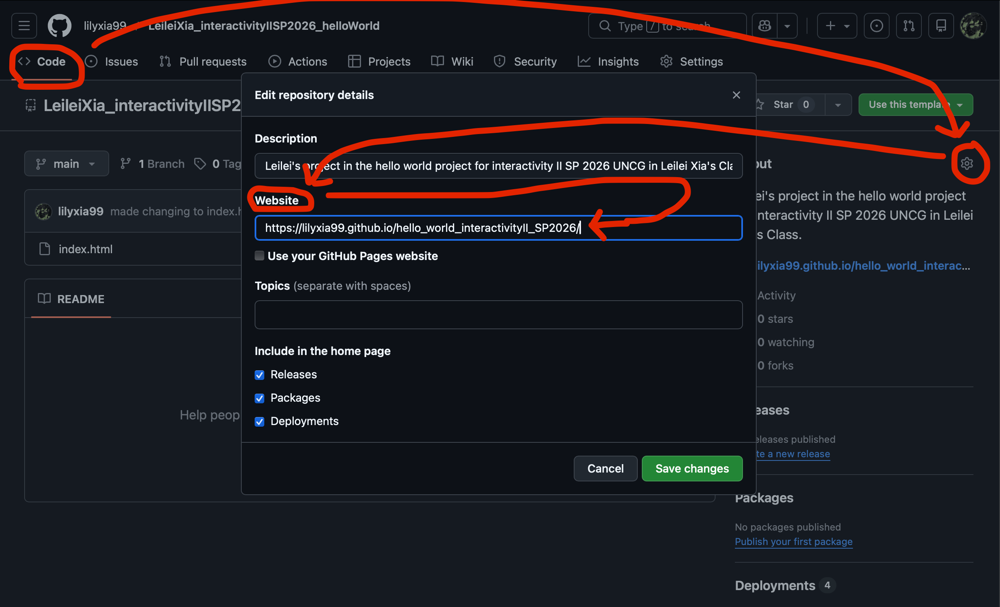

---

27. Save the url of your repository and your GitHub pages, go to the [shared document](https://uncg-my.sharepoint.com/:w:/r/personal/l_xia_uncg_edu/_layouts/15/doc.aspx?sourcedoc=%7B00e0fafe-aa00-4ee6-bc1e-c7eaf9863ac5%7D&action=edit), paste the link into your name's row corresponding column

28. Submit your repository link and GitHub pages link to [this assignment](https://uncg.instructure.com/courses/147938/assignments/1864459?module_item_id=4380985)
