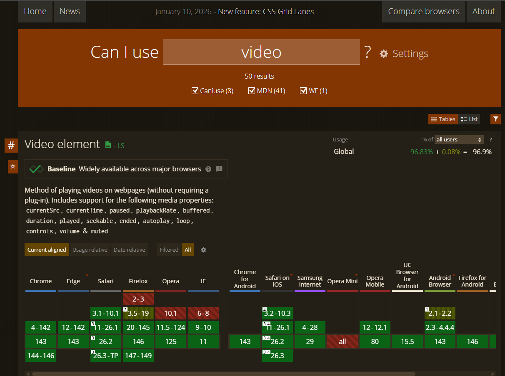
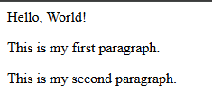
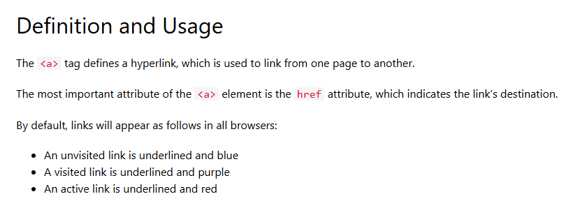
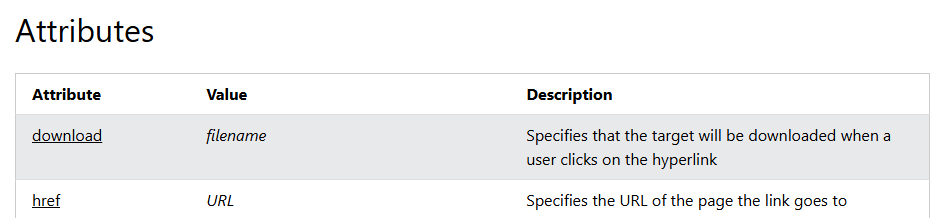
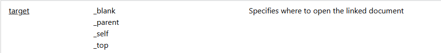
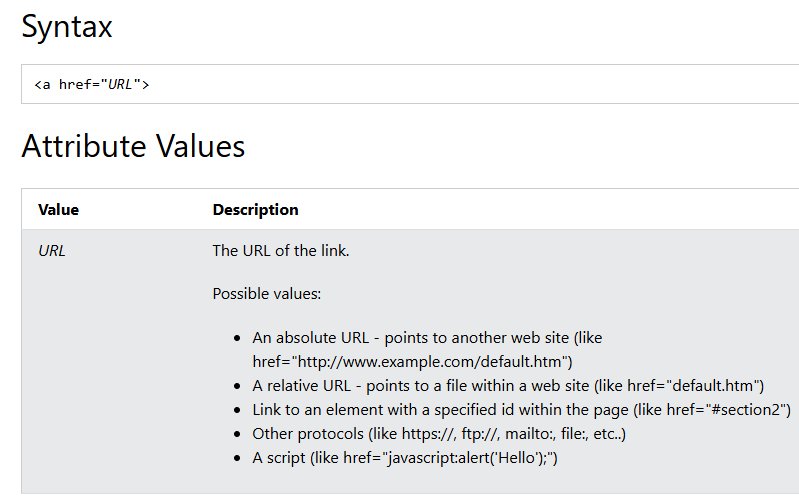
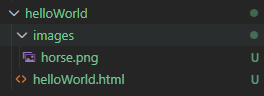

# Introduction to HTML

The Foundation of the Web

<div @click="$slidev.nav.next" class="mt-12 py-1" hover:bg="white op-10">
  Press Space for next page <carbon:arrow-right />
</div>

<!--
Welcome to this introduction to HTML. This presentation will cover the fundamentals of HTML and get you started with web development.
-->


---
transition: slide-up
---

# Navigation

Hover on the bottom-left corner to see the navigation's controls panel, [learn more](https://sli.dev/guide/ui#navigation-bar)

## Keyboard Shortcuts

|                                                     |                             |
| --------------------------------------------------- | --------------------------- |
| <kbd>right</kbd> / <kbd>space</kbd>                 | next animation or slide     |
| <kbd>left</kbd>  / <kbd>shift</kbd><kbd>space</kbd> | previous animation or slide |
| <kbd>up</kbd>                                       | previous slide              |
| <kbd>down</kbd>                                     | next slide                  |

<!-- https://sli.dev/guide/animations.html#click-animation -->

<p v-after class="absolute bottom-23 left-45 opacity-30 transform -rotate-10">Here!</p>

---
layout: default
---

# Table of Contents

<Toc minDepth="1" maxDepth="2" class="multi-col-toc" />

<style>
/* Target the generated toc element */
.slidev-toc.toc-multi-column,
.slidev-toc.multi-col-toc {
  column-count: 2 !important;
  column-gap: 2rem !important;
}

/* Prevent list items from breaking */
.slidev-toc-item {
  break-inside: avoid;
  page-break-inside: avoid;
}

/* Optional: Adjust spacing */
.slidev-toc-list {
  margin-bottom: 0.5rem;
}
</style>

---
transition: fade-out
layout: two-cols
---

# What is HTML?

HTML stands for **HyperText Markup Language**

 **Markup Language** - Uses tags to structure and format content, like using markers to **heighlight** texts, just like how I am making some of these text **red**.
 

basically the **skeleton** of a website. All the text and images information come from it.


<!--It describes the structure and content of a webpage using elements and tags.​ -->

::right::
<br>
<br>

{size:50%}

<div v-click>
These slides are also made with HTML !!
</div>

<style>
h1 {
  background-color: #E34F26;
  background-image: linear-gradient(45deg, #ac310fff 10%, #f8e110ff 50%);
  background-size: 100%;
  -webkit-background-clip: text;
  -moz-background-clip: text;
  -webkit-text-fill-color: transparent;
  -moz-text-fill-color: transparent;
}
</style>

---
layout: two-cols
transition: slide-up
level: 2
---

# Brief History of the HTML

## The Problem: A Digital Tower of Babel
- CERN (European Organization for Nuclear Research) laboratory
- different computers, softwares, document formats
- difficult to translatable or communicate

<!--In the late 1980s, the CERN (European Organization for Nuclear Research) laboratory in Switzerland was home to thousands of researchers from across the globe. These scientists all used different types of computers, software, and document formats. If a physicist wanted to share a research paper with a colleague, they often had to spend hours converting files just to make them readable.-->

::right::

the first HTML
* Tim Berners-Lee
* create the first HTML based on a pre-existing mark up language SGML
* 1991: The first public document, titled "HTML Tags," was shared. It contained only 18 tags (like `<p>`, `<h1>`, and `<a>`), many of which are still used today.
* HTML 1 -> 2 -> 3 -> 4 -> 5 ...

<!--Before HTML, Tim Berners-Lee a British computer scientist working at CERN(who is also the inventer of Internet), experimented with a system called ENQUIRE in 1980. It was a simple database of people and software modules that used "hypertext"—text that links to other text.-->

---
layout: image
image: https://www.htmhell.dev/adventcalendar/2023/5/images/HellishHistory.png
class: white-bg
level: 2
---

<style>
.white-bg{
  background-color: white;
}
</style>

---
level: 2
---

# different browser can display different things!

Check out your browser's capability in [CanIUse.com](https://caniuse.com/​)

{.w-130}

<!--So basically you search the element name in 1-->


---

# Basic HTML Template

Every HTML document follows this basic structure:

```html {all|1|2-13|3-7|8-10|all} twoslash
<!DOCTYPE html>   <!--Declares this is an HTML5 document-->
<html lang="en">   <!--html element is always the root element of the page-->
<head>   <!--Contains metadata about the document-->
  <meta charset="UTF-8">
  <meta name="viewport" content="width=device-width, initial-scale=1.0">
  <title>My First Web Page</title>
</head>
<body>  <!--Contains the visible page content-->
    Hello, World!
</body>
</html>

<!--and whatever this looks like, these are comments. 
-->
```

<arrow v-click="[5]" x1="800" y1="310" x2="900" y2="200" color="#953" width="2" arrowSize="1" style="pointer-events: none;"/>

<v-click at="5">
Copy the code to your VScode index.html
</v-click>

<!--
[click] 1. !DOCTYPE html Declares this is an HTML5 document

[click] 2. html tag  is Root element of the page. the lang=en set the language of the page

[click]3. head tag contains Contains metadata about the document
like what it's name showing up inthe browser tab, language, etc.Later we also use this section to link content

[click]4. They are not part of the code but just as references. It's like your notepad. You should always write clear comments for both yourself and others!

[click] Now go to the upper right cornor of this code block, hover your mouse there and copy the code
   -->

---

# Let's try your first HTML Element!

```html {8-11}
<!DOCTYPE html>   
<html lang="en">   
<head>   
  <meta charset="UTF-8">
  <meta name="viewport" content="width=device-width, initial-scale=1.0">
  <title>My First Web Page</title>
</head>
<body> 
  Hello, World!
                        <!--put something here!-->
</body>
</html>
```

type in:
<div class="bigCode">
```html 
<p>This is my first paragraph</p>
```
</div>

<style>
.bigCode pre code,
.bigCode code{
  font-size: 2rem;
}

</style>

---
layout: two-cols
layoutClass: gap-16
---

you just wrote a --

# HTML Element

usually something wrapped by **<>**

### Tag Anatomy

```html {1|2|3}
<tagname attribute="value">
  Content goes here
</tagname>
```

- **Tag Name** 
>Defines the element type. Is it a paragraph? an image? or a link...what you just typed in is a "paragraph element"

- **Attributes** 
>the property of the tag, like its style, class name etc
- **Content** 
>What appears on the page
- **Closing Tag** - Marks the end

::right::

Elements with both Opening and Closing Tags:
```html
<p>This is a paragraph</p>
<h1>This is a heading</h1>
<div>This is a container</div>
```

**Most of the elements need opening and closing tags!!**

<br>

Elements that only have Self-Closing Tags **(don't need Closing tag, they are rare though)**
```html

<br>
<hr>
<input type="text">
```

---
layout: two-cols
level: 2
---

# Add another paragraph

<br>

**step 1** : Add another p element right after your p element, see what it looks like.

```html {3} twoslash
<body> 
  Hello, World!
   <p>This is my first paragraph.</p><p>This is my second paragraph.</p>
</body>
```
p stands for paragrpah. What you just wrote was a paragraph element. It will always exist as a new paragraph.

::right::
<br><br><br><br><br><br>
<v-click>


<br>
what is displayed in code doesn't necessary correspond to what it looks like on the page.

</v-click>

**step 2**: try line break in your code editor and see 

```html {3-4} 
<body> 
  Hello, World!
   <p>This is my first paragraph.</p>
   <p>This is my second paragraph.</p>
</body>
```

---
layout: two-cols
level: 2
---

# Exercise(15min): try out your elements

type these down in your html, arrange them in whatever way you want

```html 
<h1>Main Heading</h1>
<h2>Heading level 2</h2>
<h3>Heading level 3</h3>
<h4>Heading level 4</h4>

<p>This is a paragraph of text. It's always going to be a single paragraph</p>
<span>This is inline text.</span>
<strong>This is bold text.</strong>

<a href="https://www.w3schools.com/tags/default.asp">This is a link to the HTML reference</a>
<i>This is italic text.</i>
<br>This creates a line break.
```
::right::

```html
<ul>
  <li>Unordered item 1</li>
  <li>Unordered item 2</li>
</ul>

<ol>
  <li>Ordered item 1</li>
  <li>Ordered item 2</li>
</ol>
```

<v-click>

**Speical:** notice that 
```html
<a href="https://www.w3schools.com/tags/default.asp">link to mdn documentation</a>
``` 
`<a>` element has an attribute, called `href`, which stands for **hypertext reference**
When using hyperlink, try to have the text be **meaningful**! (**avoid text like "here" or "click here"**) It's part of being accessible.  
</v-click>

<!--
basically whatever that is in the href is the link that this text lead you to, and the text that is being wrapped by the a tags (a stands for anchor) is the text for the hyperlink
-->

---
layout: two-cols
level: 2
---

# how to look at [a HTML element documentation](https://www.w3schools.com/tags/tag_a.asp)

click on the link above to go to a specific documentation and let's look at it



::right::



1. attribute's name: **href** 
2. it receives values like **URL** (if it's italic, it means this stands for **a type of** value, not the text itself. for example target's value is a list of option you can choose from)

3. click in to the link to **href**, see the syntax

{.w-80}

<!--
for example, as you can read **href** attribute can receive values like **URL**, and URL is basically the website address like **"www.google.com"**. but when you use it in your element, pay attention to what type of value they are. If you click in to the link to **href**, you can see it will give you examples of what it looks like.  whether or not the attribute contains **""** is important
-->
---

# Attributes
the property of the tag, like how it looks like, what links is it going to, etc

<div grid="~ cols-2 gap-4">

**Global Attributes**
Global attributes that can be used on **all** elements. So basically you can add these to any element with no-brainer (although it's possible it just have no effect)

- `id` - Unique identifier
- `class` - CSS class name
- `style` - Inline CSS styles
- `title` - Tooltip text


**Specific Attributes**
attributes that are only specific to certain elements.
- `href` - Link destination (for `<a>` tag)
- `src` - Image/script source (for `` tag)
- `alt` - Alternative text (for `` tag to explain what is in the image to screen readers)
- `type` - Input type (for `<input>` tag)

</div>

---
layout: two-cols
---

# URL vs Path

## Path

A path is like directions inside your computer. You always find thing through path

### Do this:

 Within your repository folder (on your local computer) create a folder called "images". You can put some images in there.


::right::
<div v-click>
so the path to this folder can be represented in two ways. 
</div>
<div v-click>
One is called <strong>"absolute path"</strong>. the following path is pointing to the folder "images" as absolute path
```
C:\Users\l_xia\Documents\DEVELOPER\Slidev\interactivity2\interactivityII-slides-slidev\helloWorld\images
```
</div>
<div v-click>
another way to show it is <strong>relative path</strong>. 
```
./images 
/images 
/images/horese.png 
```
the three path above are:

>1. pointing to the folder "images"from "here"(where the html lives)
>2. pointing to the folder "images" from the website root
3. =pointing to the horse.png within the image folder
</div>

<!--
[click:1] which is basically the address all the way from your root system. It's kind of like your home address that you have to write all the way to say you live in USA
[click:2] It's a little like that when you are in a house, you will just say *"I'm going to the second floor"* instead of saying I am going to "the second floor of 517 Highland Ave Greensboro North Carolina..."
-->

---

## URL
A URL is a **full internet address**. It could represent an html file, which is a webpage, or could also represent an image, a video, a pdf, which can also be viewed in browser. 

```
https://www.google.com/images/logo.png
http://example.com/about.html
```
<div v-click>
But essentially they are the address of files that exist online
</div>

<div v-click>
URL is always **absolute**. there is no abbreviation.
</div>

---


# Images and Media

when using image or media tags, you should either **relative path** or **URL**

### Images

```html


```

### Video and Audio

```html
<video controls width="400">
  <source src="video.mp4" type="video/mp4">
  Your browser doesn't support video.
</video>

<audio controls>
  <source src="audio.mp3" type="audio/mpeg">
  Your browser doesn't support audio.
</audio>
```

<div v-click mt-4>

- Always include `alt` text for accessibility
- not all browser supports video tag. look up in [caniuse.com](https://www.caniuse.com)
</div>

---
level: 2
---

# Practice (15mins) - Attributes!
practice using attributes!

1. Add an **[img tag](https://www.w3schools.com/tags/tag_img.asp)** and **[iframe](https://www.w3schools.com/tags/tag_iframe.asp)/[video](https://www.w3schools.com/tags/tag_video.asp)** tag, and one of them should have a **relative path** in your local folder, another one of them is an **url** path
2. find **2 HTML tags** that you are not familiar with, add them in your page. 

requirements:
1. each of two new tags should contain at least 1 attribute
2. 1 one them should be values like "URL" or "text" that are **a value type**(*the italic ones*), another attribute should be one from the **list of option**. (the non-italic ones)


*for those of you who are absolutely new to html, start with to [img tag](https://www.w3schools.com/tags/tag_img.asp) and [iframe](https://www.w3schools.com/tags/tag_iframe.asp) and try to read the documentation to add them in

---

# Examples

```html 

<a href="https://google.com" target="_blank">Google</a>
<input type="text" placeholder="Enter your name" required>
```


---

# Divs and Spans

Container elements for grouping and styling content

<div grid="~ cols-2 gap-8">

<div>

## The `<div>` Element

Block-level container

```html
<div class="container">
  <h2>Section Title</h2>
  <p>Section content...</p>
</div>

<div id="sidebar">
  Sidebar content
</div>
```

- Layout sections
- Grouping elements
- Applying styles

</div>

<div>

## The `<span>` Element

Inline container

```html
<p>
  This is <span class="highlight">
  highlighted text</span> in a paragraph.
</p>

<p>
  Price: <span id="price">$19.99</span>
</p>
```

- Styling parts of text
- Targeting specific words
- Adding classes to inline content, which we will talk about later

</div>

</div>

---

# Block vs Inline Elements

Understanding element behavior

<div grid="~ cols-2 gap-8">

<div>

## Block Elements

Take up full width available

```html
<div>Block element
  <p>Paragraph</p>
  <h1>Heading</h1>
</div>
```


- Start **on new line**
- Take full width (unless otherwise styled)
- Can **contain** other elements
- Height adjusts to content

</div>

<div>

## Inline Elements

Only take up necessary width

```html
<span>Inline element</span>
<a href="#">Link</a>
<strong>Bold</strong>
<em>Italic</em>

```

- Stay on same line
- Only take needed width
- **Cannot contain** block elements
- Height based on content

</div>

</div>

---
layout: two-cols
---

# HTML Comments

Comments are notes in your code that browsers ignore

```html
<!-- This is a comment -->

<!--
  This is a multi-line comment
  It can span several lines
  and won't appear on the page
-->

<h1>Visible Heading</h1>
<!-- <p>This paragraph is commented out and won't display</p> -->
<p>This paragraph will display</p>
```
::right::
<div mt-8>

## Why Use Comments?

- **Documentation** - Explain complex code sections
- **Debugging** - Temporarily disable code without deleting it
- **Collaboration** - Leave notes for other developers
- **Organization** - Mark sections of your HTML

</div>

<div mt-4>

**Note:** Comments are visible in the page source code, so never put sensitive information in comments!

</div>

---

# Semantic HTML

Semantic HTML uses tags that describe their meaning and purpose

<div grid="~ cols-2 gap-4">
<div>

## Semantic Tags

```html
<header>
  <nav>Navigation links</nav>
</header>

<main>
  <article>
    <h1>Article Title</h1>
    <p>Article content...</p>
  </article>

  <aside>Sidebar content</aside>
</main>

<footer>
  Footer content
</footer>
```

</div>
<div>

## Why Use Semantic HTML?

- **Accessibility** - Screen readers can navigate better
- **SEO** - Search engines understand content better
- **Maintainability** - Code is easier to read and understand

even if these tags technically doesn't provide werid effect for you, but it's still a good practice to use them

**Common Semantic Tags:**
`<header>`, `<nav>`, `<main>`, `<article>`, `<section>`, `<aside>`, `<footer>`

</div>
</div>

---

# HTML Best Practices

Tips for writing clean, maintainable HTML

<div grid="~ cols-2 gap-6">

<div>

## Structure

- Use proper indentation
- Close all tags properly
- Use semantic HTML
- Keep nesting logical
- One element per line

```html{1|4}
<article>
  <h1>Title</h1>
  <p>Content here</p>
</article>
```

</div>

<div>

## Accessibility

- Use alt text for images
- Label form inputs
- Use semantic tags
- Proper heading hierarchy
- Descriptive link text

```html {1|3}


<label for="email">Email:</label>
<input type="email" id="email">
```

</div>

</div>

---

# Exercise: wrapping tags around

1. Add semantic tag to your page, put titles in **`<headers>`**, the rest of the content in **`<main>`**,divide them with **`<section>`**, and in **`<footer`>** write your name
2. add a **`<div>`** within the main section, and put some of the elements within the div


HTML tags are like Russian dolls. You have to wrap one within another

<div grid="~ cols-2 gap-6">
<div>
✅ this is correct:
```html {all|2}
<div>
  <p>this is my paragraph</p>
</div>
```
</div>
<div>
❌while this is not 
```html {all|2|4}
<div> 
  <p>this is my paragraph
</div>
  </p>
```
</div>
</div>

---
layout: center
class: text-center
---

# Homework

1. Finish in [class exercise](https://uncg.instructure.com/courses/147938/assignments/1817077) before tomorrow night
2. Finish [homework](https://uncg.instructure.com/courses/147938/assignments/1864484/edit) before next Tuesday class start
3. Finish the [Quiz 1](https://uncg.instructure.com/courses/147938/assignments/1817072/edit?quiz_lti=true) before next Tuesday class start
