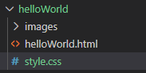
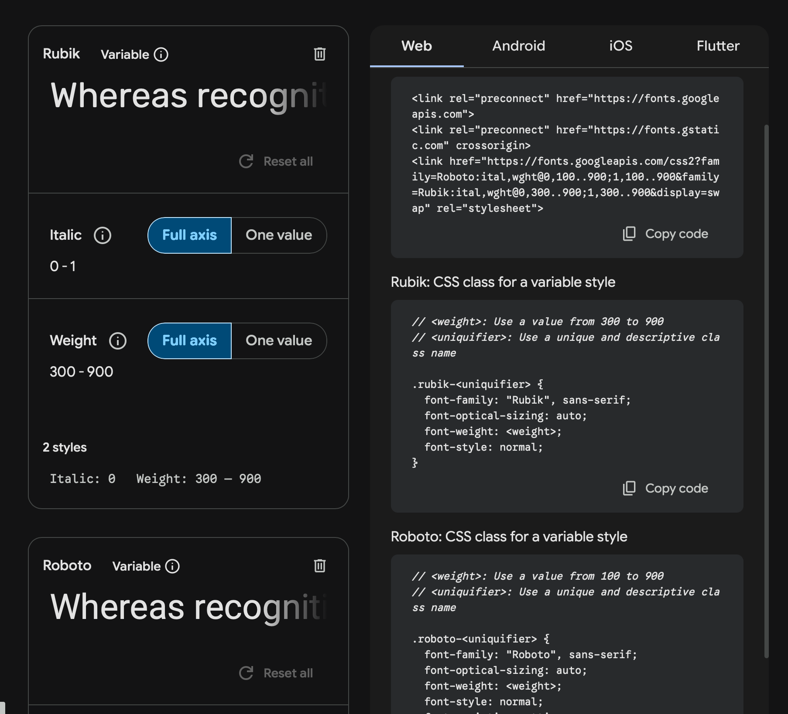
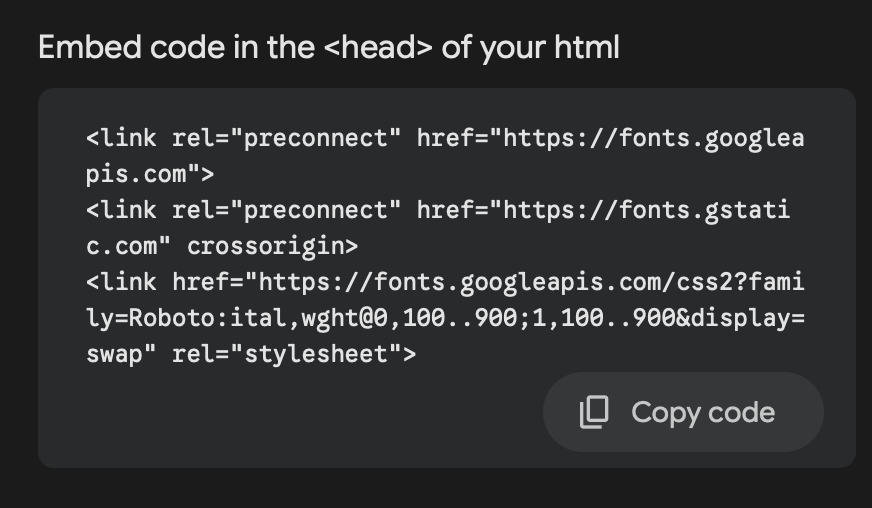

# Introduction to CSS

---

# Last Class
We go through the basics of HTML, explored different tags, thematic tags and how to read the documentation of HTML

```html
<p>This is a paragraph</p>
<header>this is a thematic tag</header>
```
Today we will talk about CSS -- how to style these tags

---
layout: two-cols
---

# Inline Style
The most basic way to write CSS is directly inside the HTML tag. We can use the style attributes to add any css styling directly in HTML. 

```html {1}
<h1 style="color: blue; font-size: 20px;">
  Hello World
</h1>
```
the inline style here change the font color of "Hello World" to blue, and their font size to 20px.

We generally avoid this in professional development because it's easy to get mixed up, but for now let's practice with this. 

::right::

<div class="code-preview">
<h1 style="color: blue; font-size: 20px;">
  Hello World
</h1>
</div>

---
layout: two-cols
---

# [position: absolute](https://www.w3schools.com/css/css_positioning.asp)
Let's try to position our object, first open up your helloWorld (the index.html) in your repository

pick any of your block elements--it could be a p element, a h1 element, a div element...and add `position:absolute` to your style attributes. (**You only add attributes to opening tags**)
```html {1}
<p style="position:absolute;top:0px;left:0px">
  This is a paragraph
</p>
```
This breaks the "Normal Flow." When you set position: absolute, the element stops "stacking" like a block. It floats above everything else, ignoring the other elements.
::right::
This is without position absolute
<div class="code-preview" style="height:200px" >
 <h1 style="position:relative;">
  Hello World
 </h1><br>
<p>
This is just a paragraph
</p>
</div>
This is with position absolute
<div class="code-preview" style="height:200px" >
 <h1 style="position:relative;">
  Hello World
 </h1><br>
<p style="position:absolute;top:0;left:0">
This is a position absolute paragraph
</p>
</div>

---

# Unit: Pixel

Pixels are Absolute Units. They are fixed in size. 100px is always 100px, regardless of screen size.

Good for: Borders, fixed-size icons.

Bad for: Responsive layouts that need to scale.

---
layout: two-cols
---

# Class
We are about to make a digital collage with all the tags you have. Before I jump in, We need to put position absolute to most of your elements. 

adding the same styling to each of your tags is tiring, so we use something called "class"

remove the style attributes, add class attributes to your tag
```html
<p class="collage">
  This is a paragraph with class
</p>
```
::right::

in your repository, create a new file, name it as "style.css"


In your index.html, in the head section, insert

```html {2-7|6}
<html lang="en">   
<head>   
  <meta charset="UTF-8">
  <meta name="viewport" content="width=device-width, initial-scale=1.0">
  <title>My First Web Page</title>
  <link rel="stylesheet" href="style.css">
</head>
<body> 
    <!--other codes you have...-->
```
---
layout: two-cols
---

In your style.css, type in:

```css
.collage{
    position: absolute;
}
```
This looks quite different from html, because css has it own anatomy.
<br><br>

## The Anatomy of CSS

<div class="bigCode">
the whole thing below ⬇️ = DECLARATION

```css
.collage  -> selector
 {
    position: -> property
       absolute; ->  value
 }

```
</div>

::right::

In CSS code, you need to first:
1. find the element you want to style (in this case, a **`.`** dot means "**class**")
>this step is done with finding the corresponding class name or id name, or just tag type...
> .class, #id, if nothing is added then it means styling all the tags under this tag name
2. declare what property you want to style 
>is it the font color? font size? or how the tag is positioned in the page? ...
3. declare what is the actual value of this property
>is the color green? is the position absolute? What is the distance from the left and right? ...

---

# ID and styling tags
apart from class, you can also give ID to elements or just select all the tags of the same catagory to style

1. in your index.html, put the following in one of your element's opening tag
```html
id="special1"
```

2. in your style.css, type down:
```css
#special1{
  background-color:red; /*this is to set the background color of that element to red. and this is how you comment in CSS*/
}

p{
  color:blue; /* This change the font color of all the paragraph elements to blue */
}
```

---

# color and background-color

The very confusing part is that `color` property is only specifically referring to changing the font color, not the background color. The `background-color` is actually changing the backgorund color. 

There are many ways to represent color in css:
1. acronyms like "blue", "green", "pink"
2. rgb color : `rgb(255, 99, 71)` r=red, g=green, b=blue
3. hex code: `#ff6347`

## Exercise: 
change the font color and background-color of your elements. Try out different color representation in the [CSS color documentation](https://www.w3schools.com/css/css_colors.asp)


---

# Priorities of Styling


---

# Exercise 1: move things around
Create a digital collage with the tags you have.

1. add `class="collage"` to the opening tags of the elements you want to reposition
2. add `style="top:__px;left:__px;"`to the collage tags, change the value of the `__` to the pixel you want.
3. Move things around, see how crazy you can get. 


---
layout: two-cols
---

# Fluid Units: % , vw, vh
While px is absolute units, these are fluid unites, which change size based on context.

**%**: 	Percentage	-- `50%` = "Be 50% as wide as my container."

**vw**	Viewport Width -- `50vw` = "Be 50% of the screen's width."

**vh**	Viewport Height -- `50vh` "Be 50% of the screen's height."

::right::

## Try it

change some of the `top` and `left` properties' values to fluid units like %, vw or vh, see what happens

<div class="code-preview" style="height:150px">
<div style="position:relative;">
<p class="collage" style="position:absolute;left:50%">left:50%</p>
</div>
</div>

---

# Exercise: Read documentation -- Width and Height

1. Add an img element to your html, or just use the img element that you already have.
2. Read [Wdith](https://www.w3schools.com/cssref/pr_dim_width.php) and  [Height](https://www.w3schools.com/cssref/pr_dim_height.php) and the [img height and width](https://www.w3schools.com/tags/att_img_height.asp) documentation, try to resize the img element (to specific px or fluid unit of your choise)


---
layout: two-cols
---

# [`transform`](https://www.w3schools.com/cssref/css3_pr_transform.php) 
This property allows you to rotate, scale, move, skew, etc., elements.

go to the documentation [`transform`](https://www.w3schools.com/cssref/css3_pr_transform.php) and read about how to use transform property. The principles goes the same: normal text are options you could directly use, *italic* text are a type of things or variable that you would need to specify further

transform: none|*transform-functions*|initial|inherit; 

the *transform-functions* represent a variety of things that you could replace into. See details in Property Values. For example

::right::

[rotate(*angle*)](https://www.w3schools.com/cssref/func_rotate.php)	Defines a 2D rotation, the angle is specified in the parameter

Means that you will put `rotate()` behind `transform:`, but in terms of what goes in the `()` is a specific anble number + deg. Read [the documentation](https://www.w3schools.com/cssref/func_rotate.php) for more

e.g.
```html
<p class="collage" style="transform:rotate(40deg)">This paragraph rotates</p>
```

<div class="code-preview" style="height:150px">
<div style="position:relative;">
<p class="collage" style="transform:rotate(-20deg)">This paragraph is slanted</p>
</div>
</div>

---

# Exercise: Wild Wild Collage

Try using all kinds of transform in your tags, see how wild you can get with their transformation. 


---
layout: two-cols
---

# Position: relative
[`position: relative`](https://www.w3schools.com/css/css_positioning.asp) keeps the element in the Normal Flow

but it lets you nudge it around from where it would normally sit, acting as a **"container"** for an absolute element.

If you put a `position: absolute` tag inside a `position: relative `tag, the absolute tag will position itself relative to **that parent**, not the whole page!

If you add `top: 10px` to a relative element, it moves down 10px from its **original spot**, but it doesn't mess up the elements around it.

## Let's try it: Crop Image!

::right::


1. Add the following attribute to one of your element's opening tag, see how it changes
```html
style="position:relative;left:100px"
```
2. In your style.css, add
```css
.cropContainer{
     position:absolute;
     overflow: hidden;
}
```
3. create a div element, add this to it
```html
 class="cropContainer" 
 style=width:200px;height:200px;"
```
 add an img element and add the following to that img element's opening tag

```html
 style="position:absolute;top:-100px;left:-100px"
``` 
3. Adjust the `top` and `left` property of the image tag, or change the `width` and `height` of the cropContainer


---

# Exercise 2: Centering items

Try to use `position:relative` and [`transform`](https://www.w3schools.com/cssref/func_translate.php) to center an element

1. create a div, give it a class name called "container"
<br> give it a `relative` position.<br> Use style attribute to set its width to  the full window view length (`100vw`). <br> height as `auto`

2. within that div, create a `<p>` element or an `` element or whatever element of your choice<br> give it a class name called "center"

3. give the "center" element styling of:<br> i. `position:absolute;`; <br> ii.`left:=50%;` <br> iii. `tranfrom:translate(-50%,0);`

*Try it yourself* Center a title to your page in the center <br>
*advance try:* think about how you can center something center vertically within the whole page

---

# [Display:](https://www.w3schools.com/cssref/pr_class_display.php) 
Display talks about how the elements under this elements are going to exist. 

1. Create an div, give it a class name called "display-exp"
2. add a couple images/p element or div elements with images or any other elements of your choice in there
3. in you css, style the display-exp class (do you still remember how to select a class to style? go back to page 7 if you forgot) with different display, see how it changes. 

for example:
```css
.display-exp{
  display:flex;
}
```


---

# [`Flexbox`](https://www.w3schools.com/css/css3_flexbox.asp)

flex container is basically laying the elements within the flex container (flex items) in a roll either horizontally OR vertically. 

## Exercise1: two column
Read the documentation for [flex box](https://www.w3schools.com/css/css3_flexbox.asp), create a two columns text box. Make sure to use [flex-direction](https://www.w3schools.com/cssref/css3_pr_flex-direction.php) to make them flow in rows so that they are two columns.

## Exercise 2: [flex](https://www.w3schools.com/cssref/css3_pr_flex.php) portion
Read the documentation for [flex](https://www.w3schools.com/cssref/css3_pr_flex.php), try to make the two column one be thinner, and another one be wider

the example is in the next page, but try to not look at the next page before doing it

---
layout: two-cols
---

## Example:
index.html:
```html
<div class="flex-container">
  <div>
    this is the text for the first column
  </div>
  <div>
    this is the text for the second column
  </div>
</div>
```
<br>
style.css:

```css
.flex-container{
  display:flex;
  flex-direction:row;
}

.flex-container div{
  flex:1;
}
```

::right::

flex = 1
<div class="code-preview" style="height:200px;">
<div class="flex-container" style="display:flex;
  flex-direction:row;width:100%;">
  <div style="flex:1">
     first column
  </div>
  <div style="flex:1">
    second column
  </div>
</div>
</div>

flex = 3, flex =7
<div class="code-preview" style="height:200px;">
<div class="flex-container" style="display:flex;
  flex-direction:row;width:100%;">
  <div style="flex:3">
     first column
  </div>
  <div style="flex:7">
    second column
  </div>
</div>
</div>

---

# Margin and Padding

Margin and paddings are important properties to give good spacing to your elements. 

Margin goes to the outside, paddings go to the inside.

{size=70%}

---

1. chagne the [background color](https://www.w3schools.com/cssref/pr_background-color.php) of your two columns. (refer to documentation) 
2. Read the documentation for [margin](https://www.w3schools.com/css/css_margin.asp) and [padding](https://www.w3schools.com/css/css_padding.asp), adding appropriate margin and padding to your two column.

the example code is in the next slide, but try not to read that before you finish the attempt

<div class="code-preview" style="height:200px;">
<div class="flex-container" style="display:flex;
  flex-direction:row;width:100%;">
  <div style="flex:3;margin:5%;padding:5%;background-color:blue;">
     first column
  </div>
  <div style="flex:7;margin:5%;padding:5%;background-color:orange;">
    second column
  </div>
</div>
</div>

---

index.html
```html
<div class="code-preview" style="height:200px;">
<div class="flex-container" >
  <div class="flex-item" style="flex:3;background-color:blue;">
     first column
  </div>
  <div class="flex-item" style="flex:7;background-color:orange;">
    second column
  </div>
</div>
</div>
```

css.style
```css
.flex-container{
  display:flex;
  flex-direction:row;
  width: 100%;
}

.flex-item{
  margin:5%;padding:5%;
}

```

---
layout: two-cols
---

# Exercise: Align items in center with flex box

we can also use flexbox to center items. 

If you just have one flex item in your flex container, you can set that one item to be in the center. <br>If you want to have the child item be in the center of the screen, for example, just set the container to be the size of the window. 

```css
.container {
  display: flex;
  justify-content: center; /* Centers items along the main axis (horizontal by default) */
  align-items: center;   /* Centers items along the cross axis (vertical by default) */
}

```

::right::
<div class="code-preview" style="display: flex;
  justify-content: center; 
  align-items: center;  ">
<div class="container">
 <div>I am in the center</div>
</div>
</div>

<style>
  .container {
  display: flex;
  justify-content: center; /* Centers items along the main axis (horizontal by default) */
  align-items: center;   /* Centers items along the cross axis (vertical by default) */
  height: 80%;
  width:80%;
  background-color:blue;
}
</style>

## Try it yourself!

wrap an element in a div element, and try to align it to the center of the element or to the center of the screen through flex

---

# Font-family

font family is the property to change the font, but its syntax is a little confusing:

It's like telling the computer: "Please use this handwriting style for my text"​
font-family: Arial; -> "Use Arial font"​
But what if the computer doesn't have Arial installed? Your text might look weird or use a random font!​<br><br>
You can give the computer multiple choices:​<br><br>
`font-family: Arial, Helvetica, sans-serif;​`<br><br>
This mean:​
"Try Arial first"​
"If you don't have Arial, try Helvetica"​
"If you don't have either, use any clean-looking font"

```css {2|3|4|5}
.anyOfYourClass{
  font-family: 
      "Arial", /* prioritize using this one */
         Helvetica, /* if the first one doesn't work, use this one */
            sans-serif; /* another fall back */
}
```
---

# Google Font

1. Go to [Google Font](https://fonts.google.com/)
2. select any font that you like
3. In that font page, click "Get Font"
4. click "Get Embed Code"
5. this part is easily confusing-- so google font will remember any font that you hit "get embed code" for, so the instruction it gives you will include getting embed all the font you want. If you just want to have some fonts, you can hit the trash can button to delete any of the font. (continue to the next page)

---

this contains multiple fonts
{size=80%}

---

1. copy the embed code
{size=50%}
2. paste the code to the `<head>` section
````md magic-move
```html {all}
<head>   
  <meta charset="UTF-8">
  <meta name="viewport" content="width=device-width, initial-scale=1.0">
  <title>My First Web Page</title>
  <link rel="stylesheet" href="style.css">
</head>
```
```html {6-8}
<head>   
  <meta charset="UTF-8">
  <meta name="viewport" content="width=device-width, initial-scale=1.0">
  <title>My First Web Page</title>
  <link rel="stylesheet" href="style.css">
  <link rel="preconnect" href="https://fonts.googleapis.com">
  <link rel="preconnect" href="https://fonts.gstatic.com" crossorigin>
  <link href="https://fonts.googleapis.com/css2?family=Rubik+Storm&display=swap" rel="stylesheet">
</head>
```
````
---
layout: two-cols
---

3. for the second part, you only need to copy the font-family part, other things are optional and it's up to you to chagne the values. Copy the line for font-family and paste it in whichever element you want to style for.
```css {2}
.rubik-storm-regular {
  font-family: "Rubik Storm", system-ui;
  font-weight: 400;
  font-style: normal;
}

```
4. optionally you can toggle to change the properties of the font on the left, and then you will get some more specific codes to copy from

::right::

<div class="code-preview" style="padding:5%;height:150px;width:70%;">
<div class="newFont">
I have a cool font
</div>
</div>

<style>
.newFont{
  font-family: "Rubik Storm", system-ui;
}
</style>

---
layout: two-cols
---

# CSS Animation

You can achieve [animation with CSS](https://www.w3schools.com/css/css3_animations.asp). You declare animation with @keyframes 

for example, in your style.css:

```css{all|1|2|3}
@keyframes changeBGColor{/* the animation's name */
  from {background-color: red;} /* stating state, needs to have a specific property expression*/
  to {background-color: yellow;} /* ending state, could have multiple ones through percentage*/
}
```

and the hen you will use that in one of the css delcaration. for example:

```css {all|2|3|4}
.animationElem{
  animation-name:changeBGColor;
  animation-duration:4s;
  animation-iteration-count: infinite;
  animation-direction: alternate;
}
```

::right::

<div class="code-preview" style="padding:5%;height:150px;width:70%;">
<div class="animationElem" style="width:100%;height:50px">
I am changing color
</div>
</div>

<style>
  @keyframes changeBGColor{/* the animation's name */
  from {background-color: red;} /* stating state, needs to have a specific property expression*/
  to {background-color: yellow;} /* ending state, could have multiple ones through percentage*/
}

.animationElem{
  animation-name:changeBGColor;
  animation-duration:4s;
  animation-iteration-count: infinite;
   animation-direction: alternate;
}


</style>

---

# Exercise: create your own CSS animation

Red the documentation of css animation, try create your own [css animaiton](https://www.w3schools.com/css/css3_animations.asp). Consider:

1. what is the property you want to animate?
2. play with the animation duration?
3. play with timing? the iterations?
4. can the animation have multiple states to change? for example the bg color changing from white to green to blue?

---

# [CSS Pseudo-clsses](https://www.w3schools.com/cssref/css_ref_pseudo_classes.php)

A CSS pseudo-class is a keyword that can be added to a selector, to define a style for a special state of an element.

for example, if you want the font color to change when your mouse is hovered on an element, you can do:

style.css
```css
.hoverElement:hover{/*add class="hoverElement" to whatever tag you want to hover */
  color:green;
}
```

<div class="code-preview" style="padding:5%;height:150px;width:70%;">
<p class="hoverElement">
hover me!
</p>
</div>

<style>
.hoverElement:hover{/*add class="hoverElement" to whatever tag you want to hover */
  color:green;
}
</style>

---

# Exercise

Read the documentation for [:hover](https://www.w3schools.com/cssref/sel_hover.php), try to make one of your element interactive so that when you hover on it, it animates a little bit. 

---

# Homework

[Decorate your online journal](https://uncg.instructure.com/courses/147938/assignments/1864485)
