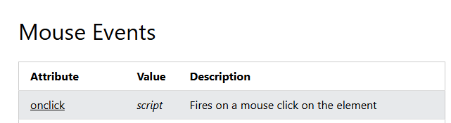
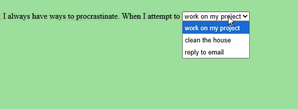

# Simple Javascript

---

<iframe width="560" height="315" src="https://www.youtube.com/embed/LARxvt45Fb0?si=pVA90qDzpKLdPDge" title="YouTube video player" frameborder="0" allow="accelerometer; autoplay; clipboard-write; encrypted-media; gyroscope; picture-in-picture; web-share" referrerpolicy="strict-origin-when-cross-origin" allowfullscreen></iframe>

**NOTICE: that when you are doing your exercise, the requirement has changes: You should create a *NEW html page* and then do the exercise.** Follow what's in the current slides

---

Think about a scenario: You have a button

<button style="background-color:white;color:black;padding:2%;">This is a button</button>

```html
<button>This is a button</button>
```

and you want it to do something when clicking on it, say you want to change its color

How would you do it？

---

# You can use Javascript event.

JavaScript is a scripting or programming language that allows you to implement complex features on web pages — every time a web page does more than just sit there and display static information for you to look at — displaying timely content updates, interactive maps, animated 2D/3D graphics, scrolling video jukeboxes, etc. — you can bet that JavaScript is probably involved.

{size=60%}

---

 To make your website interactable, you need to think about three elements:

1. When: Which Element is the trigger? What is the **triggering event**? (hover? click? right click? Double click?) 
2. Who: **Who** is changing? (this element? other element? the whole body? the whole window?)
3. How: What is the **outcome effect** (changing color? changing text? pop up box? other stuff...?)

---
layout: two-cols
---

# Triggering Event -- HTML Event Attributes

in order to define what triggers the HTML event, you can use [HTML Event Attributes](https://www.w3schools.com/tags/ref_eventattributes.asp) to directly define what would be the trigger. 

for example, I want to trigger the event when I am clicking. It is a **Mouse Event**. We can co to the section of Mouse Event



::right::

the attributes name is "onclick", then we can just put that on the html tag

```html
<button onclick="">this is a button</button>
```

all the events's value are "script", which means you define what is the action needs to be done. We could pass in a function (later in the semester we will talk about) or you can just write some script.

---
layout: two-cols
---

# Who -- DOM and querySelector

To tell script who is changing, you can get your element through Document Object Model (DOM). 

It's basically different ways you can refer to an element. 

As we mentioned before, we want to change its color, then we should find the element that refer to this button, which is `<button onclick="">this is a button</button>`. 

If you read through the documentation of [HTML DOM Elements](https://www.w3schools.com/jsref/dom_obj_document.asp) there are many ways you can find this element. 

::right::

*click through to see the animation*

1. [this](https://www.w3schools.com/Js/js_this.asp)<br>
> this is special in javascript events. In an event, this refers to the element that received the event. which is the button that has the "on-click" with it. So you could simply directly use it.

````md magic-move
```html {all}
<button onclick="">
    this is a button</button>
```
```html {all|1}
<button onclick="this">
    this is a button</button>
```
````
2. [getElementById](https://www.w3schools.com/jsref/met_document_getelementbyid.asp)<br>
> This method is a document DOM. basically you are searching for an Id with the same name under the document (which is under the html element) You need to first give this element a unique id name, and then you can get this element through the id
````md magic-move
```html {all|1}
<button onclick="" id="colorChangeButton">
    this is a button</button>
```
```html {all|2}
<button 
   onclick="document.getElementById('colorChangeButton')"
   id="colorChangeButton">
   this is a button</button>
```
````

---

3. querySelector

Another way to select element is through querySelector, but you would need to specify in the paremeter whether you are looking for class, id or just generally tag type

```html
<button 
   onclick="document.querySelector('#colorChangeButton')"
   id="colorChangeButton">
   this is a button</button>
```

if you are using class, and you want to select all the elements with the same class, you would use `getElementsByClassName` or `querySelectorAll` that would return what we call a array or a list, and that would involve a little bit complex scripting. Right now let's just focus on using id.

Tip: since we are wrapping these with "", any quotation mark within it should be ''

---
layout: two-cols
---

# What's the effect: the script itself

now we identify who is changing, we can tell the page **how** they can change

you can find all kinds of property and things you can change to an element in [DOM Element Properties and Methods](https://www.w3schools.com/jsref/dom_obj_all.asp)

for example we want to change the color of the font, that means we are changing the value of its **color** css, which would falls under the **style** attribute, so we can look at the documentation for [style](https://www.w3schools.com/jsref/prop_html_style.asp) 

::right:: 

then we can implement it

````md magic-move
```html {all}
<button onclick="this">
    this is a button</button>
```
```html {all|1}
<button onclick="this.style.color='red'">
    this is a button</button>
```
````
or
````md magic-move
```html {all|1}
<button 
   onclick=
   "document.getElementById('colorChangeButton')"
   id="colorChangeButton">
   this is a button</button>
```
```html {all|3}
<button 
   onclick=
   "document.getElementById('colorChangeButton').style.color='red'"
   id="colorChangeButton">
   this is a button</button>
```
````
now try clicking this button

<button 
   onclick=
   "document.getElementById('colorChangeButton').style.color='red'"
   id="colorChangeButton" style="background-color:white;color:black;">
   this is a button</button>

---

# Tips

How to think of the structure

You can think of document as a folder, and after each dot is a way to go under the folder. 

for example if `document.body` could mean "under html element, find the body element" and `document.getElementById('colorChangeButton')` could mean under the document, find an element with the id called "colorChangeButton". 

and then you continue to go into the folder, untill you find a document which contains informatin, like `document.getElementById('colorChangeButton').style.color`, you can't go any under it, and now the step is to change the value(content) in this thing (we call it property or variable), so you will use `=` to assign its value (change its content). That's why you say `document.getElementById('colorChangeButton').style.color='red'` because you want to change the value to 'red' instead of anything else

---
layout: two-cols
---

#  Exercise1: Simple JavaScript methods/properties

Choose 3 from the following methods/property, create a new page called "JavascriptExercise.html", copy the [default html template here](https://www.w3schools.com/html/html_basic.asp), and add your buttons. You can also refer to more in [DOM Element Properties and Methods](https://www.w3schools.com/jsref/dom_obj_all.asp)

**Output/Display:**
pop up windows 
> [`alert('message')`](https://www.w3schools.com/jsref/met_win_alert.asp) - shows popup alert
[`console.log('message')`](https://www.w3schools.com/jsref/met_console_log.asp) - prints to browser console
[`prompt('question')`](https://www.w3schools.com/jsref/met_win_prompt.asp) - shows input dialog
[`confirm('question')`](https://www.w3schools.com/jsref/met_win_confirm.asp) - shows yes/no dialog

::right::

**Element Content:**
>[`.innerHTML = 'content'`](https://www.w3schools.com/jsref/prop_html_innerhtml.asp) - sets HTML content<br>
[`.textContent = 'text'`](https://www.w3schools.com/jsref/prop_node_textcontent.asp) - sets text content<br>
[`.innerText = 'text'`](https://www.w3schools.com/jsref/prop_node_innertext.asp) - sets visible text<br>
[`.value = 'text'`](https://www.w3schools.com/jsref/prop_text_value.asp) - sets form input value


**Element Styling:**
>[`.style.color = 'red'`](https://www.w3schools.com/jsref/prop_style_color.asp) - changes CSS properties directly
[`.style.display = 'none'`](https://www.w3schools.com/jsref/prop_style_display.asp) - hides element
[`.style.backgroundColor = 'blue'`](https://www.w3schools.com/jsref/prop_style_backgroundcolor.asp) - changes background

**Class Manipulation:**
<br>
often can be used to add styling to elements
>[`.classList.add('className')`](https://www.w3schools.com/jsref/prop_element_classlist.asp) - adds class
[`.classList.remove('className')`](https://www.w3schools.com/jsref/prop_element_classlist.asp) - removes class
[`.classList.toggle('className')`](https://www.w3schools.com/jsref/prop_element_classlist.asp) - toggles class

example in the next page, but please don't look first

---

Example

```html
<button 
   onclick=
   "this.classList.add('newClass')"
   id="colorChangeButton" style="background-color:white;color:black;">
   this is a button</button>

<style>
    .newClass{
        opacity:0;
    }
</style>
```
This script will add a class to the button, which will make it disappear

try clicking the button below

<button 
   onclick=
   "this.classList.add('newClass')"
   id="colorChangeButton" style="background-color:white;color:black;">
   this is a button</button>

<style>
    .newClass{
        opacity:0;
    }
</style>

---

# Exercise 2: Change Event type

Read through the documentation of [HTML Event Attributes](https://www.w3schools.com/tags/ref_eventattributes.asp), change the event type so that the trigger event is different. Some of the event might not be suitable for button, so you can change the element that you are putting this event attribute on (for example onKeyDown would be more suitable for input box) 

example in the next page, but please don't look first

---

Example

```html
<button onmouseover="alert('Oh you found me!')">This is a button</button>
```
now as long as your mouse move over the button, it pops up the alert box

<button onmouseover="alert('Oh you found me!')" style="background-color:white;color:black;padding:3%">This is a button</button>


---

# Exercise 3: Why you put an effect their

create an effect on an element, so that it feels like the effect "make sense", as if the effect fit with the content that the element is providing. You can thinking of telling a story, or you can think of it almost like an animation that illustrate the feeling of that element.

think of changing the 
1. triggering event: [HTML Event Attributes](https://www.w3schools.com/tags/ref_eventattributes.asp)
2. who is the trigger(where you put the event attribute)
3. who to change: [HTML DOM Elements](https://www.w3schools.com/jsref/dom_obj_all.asp)
4. how it's changing: [DOM Element Properties and Methods](https://www.w3schools.com/jsref/dom_obj_all.asp)

example in the next page

---

Example:

<style scoped>
  pre {
    white-space: pre-wrap; /* or normal */
    word-wrap: break-word;
    font-size: 0.8em; /* Adjust font size if needed */
  }
</style>
```html
   I always have ways to procrastinate. When I attempt to
<select id="todo" onchange="document.getElementById('iWould').innerHTML=`${document.getElementById('todo').value}`">
  <option value="then I would be afraid of falling behind on other immediate deadlines. Most of the bullshit jobs are immediate. I know working on my projects are the upmost important thing, but sometimes I feel that's luxrious">work on my project
  <option value="then I would think: Oh I would need to do my projects, reply to emails, other collective obligations...Oh wait maybe I can walk my dog...">clean the house
  <option value="reply to emails doesn't intrincially give me satisfaction. It does help if it cleans up more, but I mean, at the end of the day, it's emails. It's not like artworks that will generate a lot of long term effect, but I still need to reply to them!">reply to email
</select>

```




---
layout: two-cols
---

# [Optional] <br> Advance: Back and Forth

Set a condition

in our previous example, we can only change the color from black to red, but we can't change it from red to black and back and forth. 

one way to do it is through if statement. We will talk about it more later, but if you want to try it, you can refer to [If conditions](https://www.w3schools.com/Js/js_conditionals.asp)

::right::

for the previous example, to set the button back and forth, you could say: (*click through the steps to show the animation and full code*)

````md magic-move
```html {all}
<button onclick="this.style.color='red'">
    this is a button</button>
```
```html {all|2-5}
<button onclick=
    "if(this.style.color=='red')//this is two equal sign = =
     {this.style.color='black'}
     else
     {this.style.color='red'}">
    this is a button</button>
```
````
Tips:
* `==` -> = = two equal signs means evaluating whether the value from the right is equal to the left
* things in `()` is the condition, it means if whatever condition within () is true, then the things in the bracket will run.  

<button onclick=
    "if(this.style.color=='red')//this is two equal sign = =
     {this.style.color='black'}
     else
     {this.style.color='red'}" style="background-color:white;color:black">
    this is a button</button>

---
layout: two-cols
---

# [Optional] <br> how to use `` Backticks 

to access different values within the script

If you know what you are doing, and you want to do some kind of calculation within the script, instead of using `""` for the event value, you can use ``, pairing it with ${} it allows you to do calculations or refer different values within the script expression. 

for example, I read the event documentation of "onresize", and I want to change the background color of the slide as soon as it resizes, and also based the color on its window size. then I can do:

::right::

```html
<body onresize="document.body.style.backgroundColor=`rgb(${window.innerWidth/4},${window.innerHeight/4},150)`">
```


---

# In Class Assignment

Finish and submit [in class assignment](https://uncg.instructure.com/courses/147938/assignments/1898099) for simple Javascript