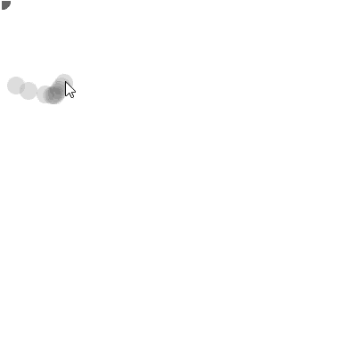
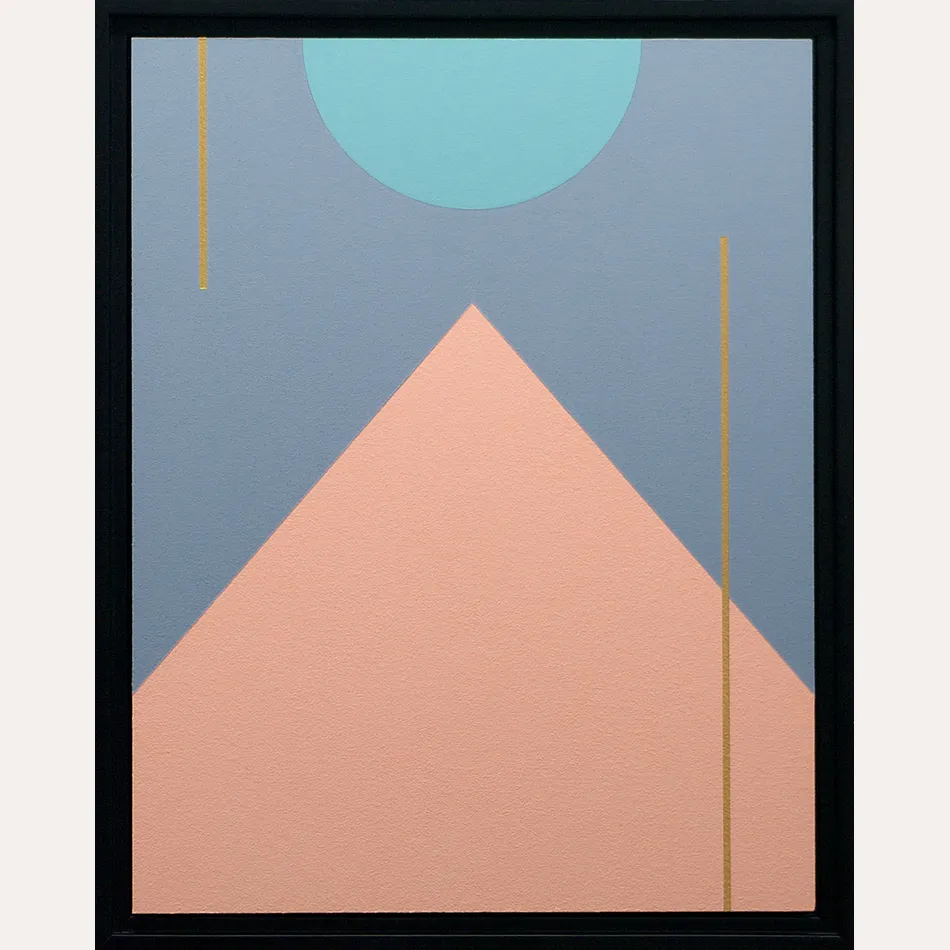

# WHAT IS P5.JS

2026 Leilei Xia

---

# What is P5.js

p5.js is a JavaScript library for creative coding. A collection of pre-written code, it provides us with tools that simplify the process of creating interactive visuals with code in the web browser.

---
layout: two-cols
---

# Web based? What is Web?

- HTML
- CSS
- Script ← this is where p5js sketches can live; the online editor also allows will create the html to make a webpage or generate code to embed


::right::


---

## Get your set up

1. go to [p5.js](https://p5js.org/), hit "Start Coding" on the bottom left
2. after going into the editor interface, hit "sign up" on the top right, register your account
3. on the top menu, File->New,  rename your sketch by clicking the name beside "Auto-refresh", set it to "In-Class-1-Intro"

---
layout: center
---

# Take a Sip

---

# Exercise: Drawing App

Type these code into your p5.js code:

```js
function setup() {
  createCanvas(400, 400); // create the canvas
  background(220, 225, 225, 50); // set background color
}

function draw() {
  fill(100, 100, 100, 50); // set my brush stroke, I set it transparent
  noStroke(); // no outline stroke for the brush
  circle(mouseX, mouseY, 20); // circle's center goes with mouse, and the diameter is always 20
}
```

---



---
layout: two-cols
---

## What is in the front, what is in the back

p5.js follows a "painter's algorithm" — it draws elements in the order they are written in the `draw()` function. This means:

- First-drawn elements appear at the back.
- Later-drawn elements appear on top.

::right::

# Exercise: Change something

1. try changing the numbers in the fill to 255, especially the fourth number, see what happen
2. change noStroke() to stroke(255)
3. try changing something in the code, any of the numbers, see what happens

for example

````md magic-move
```js 
function setup() {
  createCanvas(400, 400); // create the canvas
  background(220, 225, 225, 50); // set background color
}

function draw() {
  fill(100, 100, 100, 50); // set my brush stroke, I set it transparent
  noStroke(); // no outline stroke for the brush
  circle(mouseX, mouseY, 20); // circle's center goes with mouse, and the diameter is always 20
}
```
```js 
function setup() {
  createCanvas(400, 400); 
  background(220, 225, 225, 50); 
}

function draw() {
  fill(255, 0, 255, 255); // this represent rgba. 
  //  255 is the biggest value for each color light
  stroke(100); // stoke() is for setting the color of the stroke of the shape
  circle(mouseX, mouseY, 20); // circle's center goes with mouse, and the diameter is always 20
}
```
````
---

# P5 2D Painting

Draw a minimalist Painting with P5.js

---

# Let's Draw something in P5.js!

Tell [P5.js](https://p5js.org) how to draw this painting

{.w-80}

---


# setup(), createCanvas() and draw() functions

`setup()` → Only run once, usually used to start the canvas and other functions that needs to be used

Let's change the canvas to make it taller:

```js
function setup() {
  createCanvas(400, 500);
}
```

`draw()` → run repeatedly for every frame, could be used to create things that will be changing through time. We will use it later on.

---

# What is a function

A function is a reusable block of code that performs a specific task. Functions help in organizing code, reducing repetition, and improving readability.

A function in JavaScript (or any programming language) usually has:
- function name (to identify it)
- Parameters (optional inputs)
- A body (the code it executes)
- A return value from the function (optional output)

---

# Function = transformation

`makeDish()` could be a function.

But what to make? The ingredient is the parameter:

```js
makeDish(fish)
```

How to make the dish? It is decided when you define the function:

```js
makeDish(fish) {
  steam(fish);
}
```

Maybe you want an output from it:

```js
makeDish(fish) {
  steam(fish);
  return dish;
}
```

---

# What is a p5.js Function?

p5.js is a JavaScript library for creative coding. It provides many built-in functions to make drawing and animation easier. These functions are used to create graphics, handle user input, manipulate sound, and more.

---

# Common p5.js Functions

- `setup()` – Runs once at the start.
- `draw()` – Loops continuously to create animations.
- `createCanvas(width, height)` – Sets up the drawing area.
- `background(color)` – Sets the background color.
- `fill(color)` – Sets the fill color for shapes.
- `rect(x, y, width, height)` – Draws a rectangle.
- `ellipse(x, y, width, height)` – Draws an ellipse.
- `mousePressed()` – Detects mouse clicks.
- `keyPressed()` – Detects key presses.

---

# NAMING CONVENTION

Notice that `createCanvas` is stuck together and the second word has a capital first character.

**camelCase** is our naming convention:
- The first word → all lower case
- The second word → the first character is upper case

---

# Set background() color

`background()` — inside the `()` you can put in the color you want, similar to CSS. If you put in a hex code, remember to put it in with quotation marks.

```js
function setup() {
  createCanvas(400, 500);
  background(0);
}
```

---

# How to Read Documentation

- Look at the syntax
- Pay attention to Parameters
- Pay attention to Parameter type

E.g. `v1`, `v2`, `v3` are Numbers, so they are just numbers like `4` or `200` that fit the requirement.

`colorstring` → String, so it needs quotation marks like `"pink"`

**Syntax:**
```
background(color)
background(colorstring, [a])
background(gray, [a])
background(v1, v2, v3, [a])
background(values)
background(image, [a])
```

---

# Let's draw a Rectangle

```js
function setup() {
  createCanvas(400, 500);
  background("black");
  rect(25, 25, 350, 450);
}
```

---

# Let's look at the syntax again

When a parameter is wrapped by `[]` it means it's optional — if you don't put it in, it's still gonna work.

**Syntax:**
```
rect(x, y, w, [h], [tl], [tr], [br], [bl])
```

---

# Coordinate System

P5 origin point starts from the upper left corner.

- 2D: `(0, 0)` at top-left, x goes right, y goes down
- 3D: `(0, 0, 0)` at top-left, adds z axis

---

# Fill() and text() in draw()

`fill()` can change the color of whatever shape is drawn **after** this line.

`text()` can write text on the screen.

````md magic-move
```js
function draw() {
  fill(255)
  text(`mouseX: ${mouseX}, mouseY: ${mouseY}`, 20, 20);
}
```
```js
function draw() {
  background(0);
  fill(255)
  text(`mouseX: ${mouseX}, mouseY: ${mouseY}`, 20, 20);
}
```
````

You can see text, but it gets blurred soon (because `draw()` is running repeatedly without a `background()` to clear it).

---
layout: two-cols
---

# Put background and rectangle in draw()

`draw()` runs every frame and draws on top of whatever's already there. To keep things refreshed, put `background()` in `draw()` so it always wipes out the previous frame. But then it will also wipe out the rectangle, so put `rect()` there too.

```js
function setup() {
  createCanvas(400, 500);
}

function draw() {
  background("black");
  rect(25, 25, 350, 450);
  fill(255)
  text(`mouseX: ${mouseX}, mouseY: ${mouseY}`, 20, 20);
}
```
::right::

Now you can see the x and y

Your mouse position will show the exact x and y coordinate of that point.

---

# Exercise: change the rectangle color

Add a `fill()` before `rect()` so that the rectangle is set to the right color.

Google "color picker" to choose your color.


---

# Exercise: Add a circle()

Try looking at the syntax explanation, without referring to the next page, write your own code for the circle.

**Syntax:**
```
circle(x, y, d)
```

---

# Adding a circle — example

```js
function setup() {
  createCanvas(400, 500);
}

function draw() {
  background("black");
  fill(165, 196, 212);
  rect(25, 25, 350, 450);
  fill(255)
  text(`mouseX: ${mouseX}, mouseY: ${mouseY}`, 20, 20);
  fill("#a1dfff");
  circle(200, 25, 160);
}
```

`circle(x, y, size)` — x and y are the center point, size is the diameter.

---

# Problems

Issues we encounter:
- The order of the drawing
- The black outline on the circle
- Circle is not cropped at the top
- Text gets covered

---

# noStroke() → Set without outline

```js
function setup() {
  createCanvas(400, 500);
}

function draw() {
  background("black");
  fill(165, 196, 212);
  rect(25, 25, 350, 450);
  fill(255)
  text(`mouseX: ${mouseX}, mouseY: ${mouseY}`, 20, 20);
  fill("#a1dfff");
  noStroke();
  circle(200, 25, 160);
}
```

---

# arc()

Use `arc()` instead of `circle()` to draw only a half-circle so it stays cropped:

```js
function setup() {
  createCanvas(400, 500);
}

function draw() {
  background("black");
  fill(165, 196, 212);
  rect(25, 25, 350, 450);
  fill(255)
  text(`mouseX: ${mouseX}, mouseY: ${mouseY}`, 20, 20);
  fill("#a1dfff");
  noStroke();
  arc(200, 25, 160, 160, 0, PI);
}
```

---

# arc() — Angle Reference

**Syntax:**
```
arc(x, y, w, h, start, stop, [mode], [detail])
```

Angle reference (clockwise from right):
- `0` → right
- `PI/2` → bottom
- `PI` → left
- `3/2 * PI` → top

`x, y` = center point, `w` = width, `h` = height

---

# Exercise: draw the pink Triangle

Without referring to the next page, draw the pink Triangle with the correct color and position.

Let's simplify the drawing into something like this *(triangle with peak at top-center, base at bottom)*.

---

# Adding the triangle — example

```js
function setup() {
  createCanvas(400, 500);
}

function draw() {
  background("black");
  noStroke(); // move noStroke to top because all shapes except line don't need outline
  fill(165, 196, 212);
  rect(25, 25, 350, 450);
  fill(255)
  text(`mouseX: ${mouseX}, mouseY: ${mouseY}`, 20, 20);
  fill("#a1dfff");
  arc(200, 25, 160, 160, 0, PI);
  fill(255, 192, 161);
  triangle(200, 165, 25, 475, 375, 475); // top, left corner, right corner
}
```

---

# Comment

Use `//` to comment on your code.

```js
rect(25, 25, 350, 450); // this draws the background rectangle
```

---

# Exercise: read the documentation of line(), strokeWeight() and stroke()

Draw the two gold lines.

Without referring to the next page. Pay attention to the order of `fill()`, `stroke()`, and `line()`.

Your logic should be:
1. Set the Stroke Color with `stroke()`
2. Set the stroke thickness with `strokeWeight()`
3. Draw the line with `line()`

**Tips:** You will run into trouble — consider the order of the drawing.

---

# Drawing the lines — example

```js
function setup() {
  createCanvas(400, 500);
}

function draw() {
  background("black");
  noStroke(); // move noStroke to top because all shapes except line don't need outline
  fill(165, 196, 212);
  rect(25, 25, 350, 450);
  fill(255)
  text(`mouseX: ${mouseX}, mouseY: ${mouseY}`, 20, 20);
  fill("#a1dfff");
  arc(200, 25, 160, 160, 0, PI);
  fill(255, 192, 161);
  triangle(200, 165, 25, 475, 375, 475); // top, left corner, right corner
  strokeCap(SQUARE); // optional, so that the lines are cleaner
  stroke('#d1b960'); // set the stroke color
  strokeWeight(5); // set the stroke weight
  line(65, 25, 65, 175); // draw the left line
  line(330, 123, 330, 475); // draw the right line
}
```

---

# Complete your comments and notes

Final commented code:

```js
function setup() {
  createCanvas(400, 500);
}

function draw() {
  background("black");
  noStroke(); // move noStroke to top because all shapes except line don't need outline
  fill(165, 196, 212); // paint the background rectangle
  rect(25, 25, 350, 450); // draw the rectangle
  fill(255) // color the text
  text(`mouseX: ${mouseX}, mouseY: ${mouseY}`, 20, 20); // write the text
  fill("#a1dfff"); // color the half circle
  arc(200, 25, 160, 160, 0, PI); // draw the half circle
  fill(255, 192, 161); // color the triangle
  triangle(200, 165, 25, 475, 375, 475); // top, left corner, right corner
  strokeCap(SQUARE); // optional, so that the lines are cleaner
  stroke('#d1b960'); // set the stroke color
  strokeWeight(5); // set the stroke weight
  line(65, 25, 65, 175); // draw the left line
  line(330, 123, 330, 475); // draw the right line
}
```

---

# Exercise: Find a minimalist painting of your choice, try to duplicate it

- Your code should have your comments on.
- Example code
- Assignment page

---

# Depending on where the background is

When `background()` is in `setup()`, it only clears once:

```js
function setup() {
  createCanvas(400, 400);
  print("background drew");
  background(255, 150, 225); // first clean up the frame with the pink color
}

function draw() {
  fill(100, 255, 255); // define the color of the circle
  // noStroke(); // no outline of the circle
  circle(mouseX, mouseY, 80); // circle goes with mouse
  print("circle drew");
}
```

When `background()` is in `draw()`, it clears every frame:

```js
function setup() {
  createCanvas(400, 400);
  print("background drew");
}

function draw() {
  background(255, 150, 225); // first clean up the frame with the pink color
  fill(100, 255, 255); // define the color of the circle
  // noStroke(); // no outline of the circle
  circle(mouseX, mouseY, 80); // circle goes with mouse
  print("circle drew");
}
```